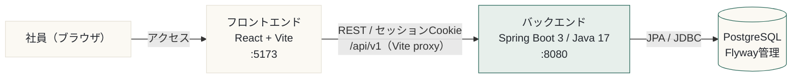
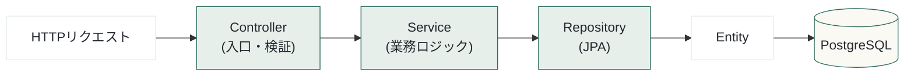

# Noa（社内SNS）

役職・見た目・閲覧の圧から解放された、**社外秘も話せる**社内向けSNS。
新卒研修のチーム開発（グループ4）で制作。

- **バックエンド**：Spring Boot 3 / Java 17 / Maven / PostgreSQL / Flyway（`noa/`）
- **フロントエンド**：React 19（Vite）/ JavaScript（`noa-frontend/`）
- **構成**：モノレポ（1リポジトリにバック・フロントを同梱）

---

## 技術スタック

| 領域 | 採用技術 |
|---|---|
| フロントエンド | React 19 / Vite / react-router-dom 7 / 素の `fetch`（HTTPライブラリ不使用）/ 独自CSS（`theme.css`） |
| バックエンド | Spring Boot 3.5 / Java 17 / Maven |
| データベース | PostgreSQL（スキーマは **Flyway** がSQLで管理） |
| 認証 | Spring Security（**セッション＋Cookie**） |
| API仕様 | springdoc-openapi → **Swagger UI** |

---

## アーキテクチャ概要

標準的な3層構成。フロントは Vite の開発サーバ（:5173）、バックは Spring Boot（:8080）、永続化は PostgreSQL。
開発時はフロントの `/api` リクエストを Vite プロキシがバック（:8080）へ転送する。



バックエンドは **Controller → Service → Repository → Entity** の層構造で、外部とのやり取りは **DTO**（外向けの箱）を介する（Entity をそのまま返さない）。



---

## ディレクトリ構成

```
（リポジトリルート）
├── noa/              # バックエンド（Spring Boot / Maven）
│   └── src/main/
│       ├── java/noa/
│       │   ├── controller/   # REST エンドポイント（入口・検証）
│       │   ├── service/      # 業務ロジック（@Transactional）
│       │   ├── repository/   # Spring Data JPA
│       │   ├── entity/       # JPA エンティティ（DBの1行）
│       │   ├── dto/          # リクエスト/レスポンスの箱（秘匿の境界）
│       │   ├── config/ security/  # Spring Security 設定
│       │   └── mock/         # 開発用モック（ping 等）
│       └── resources/db/migration/   # Flyway マイグレーション（V*.sql）
├── noa-frontend/     # フロントエンド（React + Vite）
│   └── src/
│       ├── pages/        # 画面（タイムライン/プロフィール/検索/通知/管理 …）
│       ├── components/   # layout/・post/ 等の部品
│       ├── api/client.js # fetch ラッパ（/api/v1・credentials:'include'）
│       ├── context/      # AuthContext（セッション復元）
│       └── styles/theme.css  # デザイントークン（色・フォント）
├── noa-design/       # 設計・まとめ・デザイン仕様（設計概要書 / ER / API / スライド 等）
├── noa-support/      # 実装ナレッジ（未経験者向け手順書シリーズ）
└── README.md
```

---

## 必要な環境

| ツール | バージョン目安 |
|---|---|
| JDK | 17（Temurin 等） |
| Node.js | 18 以上（推奨 20+） |
| PostgreSQL | 16（5432 で待受） |
| Git | 2.x |

---

## セットアップ・起動手順

### 1. リポジトリを取得

```bash
git clone <このリポジトリのURL>
cd <クローンしたディレクトリ>
```

### 2. データベースを用意（初回のみ）

PostgreSQL に管理者で入り、専用ロールとDBを作成する（既定の接続設定に合わせる）。

```bash
psql -U postgres
```

```sql
CREATE ROLE noa WITH LOGIN PASSWORD 'noa_pass';
CREATE DATABASE noa OWNER noa;
GRANT ALL PRIVILEGES ON DATABASE noa TO noa;
\q
```

> 起動時に `permission denied for schema public` が出たら、`psql -U postgres -d noa` で入って `GRANT ALL ON SCHEMA public TO noa;` を実行。

### 3. バックエンドの接続設定（初回のみ）

`noa/src/main/resources/application.properties` は Git 管理外（各自のローカル設定）。
無ければ以下の内容で作成する（DBを上記と別の値にした場合はここを合わせる）。

```properties
spring.datasource.url=jdbc:postgresql://localhost:5432/noa
spring.datasource.username=noa
spring.datasource.password=noa_pass

# スキーマは Flyway が管理。Hibernate の自動DDLは無効
spring.jpa.hibernate.ddl-auto=none
spring.flyway.enabled=true
```

### 4. バックエンドを起動（:8080）

```bash
cd noa
./mvnw spring-boot:run        # Maven Wrapper 同梱
# ラッパーが動かない環境では、JDK 17 上の system Maven を使う:
#   mvn spring-boot:run
```

- 初回起動時に **Flyway** が `src/main/resources/db/migration/` の `V1`〜`V10`（スキーマ）と `V100`（開発用 seed）以降を自動適用する。
- ログに `Started NoaApplication ...` が出れば成功。
- 疎通確認：`http://localhost:8080/api/v1/ping` → `{"status":"ok","service":"noa"}`

### 5. フロントエンドを起動（:5173）

別ターミナルで：

```bash
cd noa-frontend
npm install        # 初回のみ
npm run dev
```

- `http://localhost:5173/` を開く。`/api` へのリクエストは Vite プロキシ経由でバック（:8080）へ転送される（`vite.config.js`）。

### 6. 開発用ログイン

| 項目 | 値 |
|---|---|
| ログイン（メールアドレス） | `user001@skywill.jp` 〜 `user006@skywill.jp` |
| パスワード | `password1`（全ユーザー共通） |
| 管理者（ADMIN） | `user001@skywill.jp`（表示ハンドル `Noa-001`） |

> ログインは**メールアドレス**で行う。`Noa-001`〜`Noa-006` は画面に表示される**秘匿ハンドル**（識別子）であり、ログインIDではない。
> seed では投稿・返信（コメントツリー）・いいね・フォロー・タグフォロー・通知まで投入済み。

### 7. API仕様（Swagger UI）

起動後、`http://localhost:8080/swagger-ui.html` で全エンドポイントを確認・実行できる。

---

## マイグレーション番号のルール（⚠ チーム重要事項）

スキーマ変更は必ず **Flyway** で行う。**適用済みのマイグレーションは編集せず**、新しい `V◯◯__*.sql` を追加する。番号は次のルールに従う：

| 番号 | 用途 |
|---|---|
| `V1`〜`V10` | 初期スキーマ |
| `V100` | seed（開発用テストデータ） |
| `V101` / `V102` | comments / reports テーブル追加 |
| `V103` | comments に `parent_comment_id` 追加（返信ツリー化） |
| **`V104` 以降** | **次に作るマイグレーションはここから続ける** |

> **⚠ `V11`〜`V99` は使用禁止。**
> `V100`（seed）より小さい番号を後から足すと、Flyway の out-of-order で**起動に失敗する**。番号は必ず最新（現状 `V103`）より大きい `V104` 以降を採番すること。チーム全員に周知が必要なルール。

---

## 認証の概要

セッション（Cookie）ベース。ログイン成功時に `SecurityContext` を HTTP セッションに保存し、以降は `JSESSIONID` で認証する。アクセス制御は `SecurityConfig` で定義：

| パス | アクセス |
|---|---|
| `/api/v1/auth/**`・`/api/v1/ping`・Swagger | 誰でも可（公開） |
| `/api/v1/admin/**` | `ADMIN` ロールのみ |
| その他すべて | 要ログイン |

---

## ドキュメント / ナレッジ

| 置き場所 | 内容 |
|---|---|
| `noa-design/` | 設計概要書・最新ER図・API仕様・機能一覧・発表スライド 等 |
| `noa-support/` | 実装の手順書シリーズ（未経験者向け。backend.html ＝ 全体地図、backend-playbook.html ＝ 進め方、backend-handson.html ＝ 写経 等） |
| Swagger UI | `http://localhost:8080/swagger-ui.html`（起動後） |

> 設計資料と実装にズレがある場合は **実装（コード）を正**とする。最新の正確なスキーマは `noa/src/main/resources/db/migration/` の `V*.sql` と `entity/` を参照。

---

## 開発のお約束

- **スキーマ変更は Flyway で**：適用済みの `V*.sql` は編集せず、新しい番号（`V104` 以降）で追加する（上記ルール参照）。
- **秘密情報をコミットしない**：`application.properties` や `.env` は Git 管理外。
- **モノレポ**：バック（`noa/`）とフロント（`noa-frontend/`）は同一リポジトリ。両方を起動して動作確認する。
- ブランチ運用・PR・issue 管理はチームの取り決めに従う。
